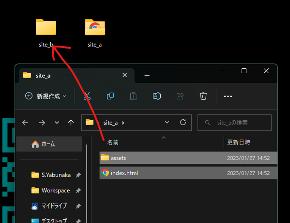
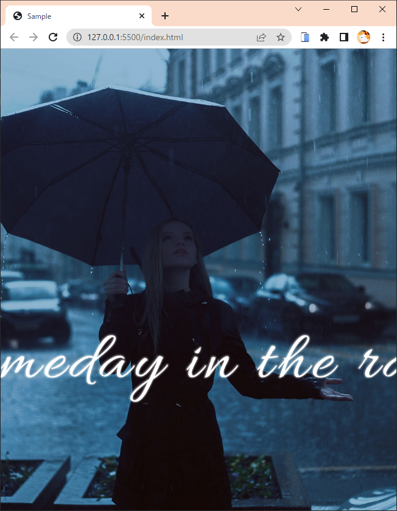

# 表示について

- [ ] 別の端末やフォルダに移動しても正しく表示されること  
  
- [ ] 表示されていない画像がないこと
- [ ] スタイルや動きが正しく反映されること
- 複数の画面幅で崩れなく表示されること  
  意図しない横スクロールが発生しないこと
  - デスクトップ
    - [ ] 2560x1440
    - [ ] 1920x1080
    - [ ] 1536x864
    - [ ] 1440x900
    - [ ] 1366x768
    - [ ] 1280x720
  - モバイル
    - 412x915
      - [ ] 縦持ち
      - [ ] 横持ち
    - 393x852
      - [ ] 縦持ち
      - [ ] 横持ち
    - 390x344
      - [ ] 縦持ち
      - [ ] 横持ち
    - 375x812
      - [ ] 縦持ち
      - [ ] 横持ち
    - 375x667
      - [ ] 縦持ち
      - [ ] 横持ち
  - タブレット
    - 1024x1366
      - [ ] 縦持ち
      - [ ] 横持ち
    - 834x1194
      - [ ] 縦持ち
      - [ ] 横持ち
    - 820x1180
      - [ ] 縦持ち
      - [ ] 横持ち
    - 810x1080
      - [ ] 縦持ち
      - [ ] 横持ち
    - 768x1024
      - [ ] 縦持ち
      - [ ] 横持ち
    - 744x1133
      - [ ] 縦持ち
      - [ ] 横持ち
- [ ] 画面比を変更したときに文字情報などの見切れが発生しないこと  
  
- [ ] リンクやボタンの動作に問題がないこと
- [ ] 表記の書き間違いや誤字・脱字がないこと  
  ※ 企業名、商品名、言語名、人物名などの誤字はないか
